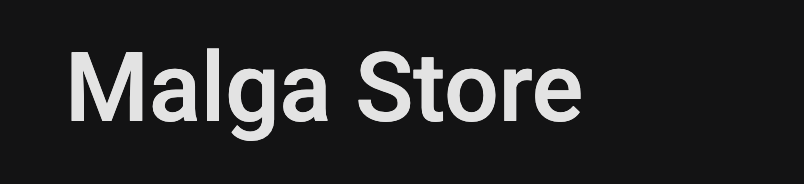

<p align="center">
  
</p>

# Malga Store

Este é um projeto de e-commerce desenvolvido em Next.js.

## Instalação

Para instalar as dependências do projeto, execute:

```bash
npm install
```

## Rodando o projeto

Para iniciar o servidor de desenvolvimento, utilize:

```bash
npm run dev
```

O projeto estará disponível em [http://localhost:3000](http://localhost:3000).

## Qualidade de código

- Este projeto utiliza **ESLint** para garantir a padronização e qualidade do código JavaScript/TypeScript.
- Também utiliza **Prettier** para formatação automática do código, facilitando a manutenção e leitura.

---

Sinta-se à vontade para contribuir ou sugerir melhorias!
